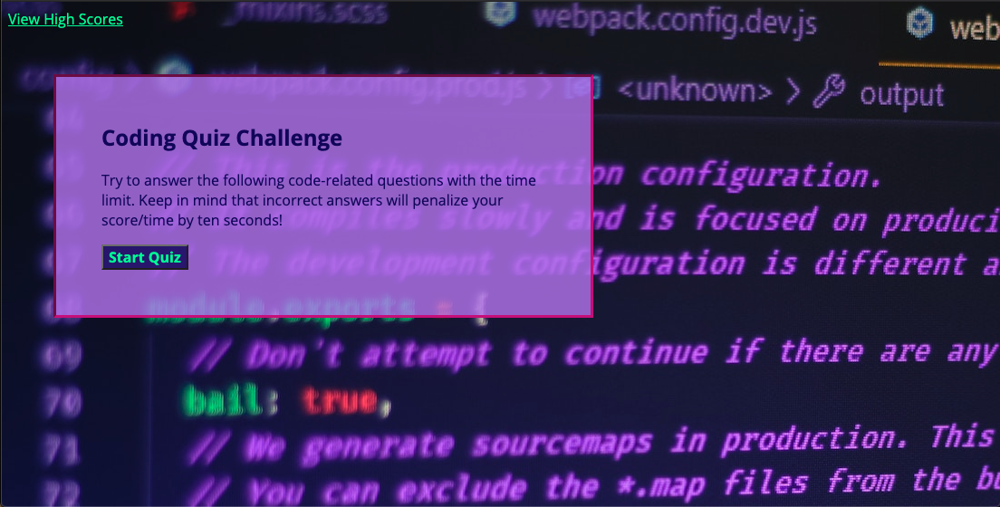
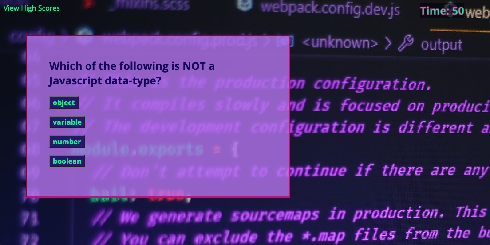
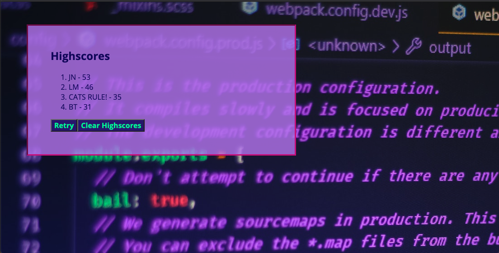

# Coding Quiz

## Description

Test your knowledge of Javascript fundementals with this short and deceptively easy timed quiz! Watch out, incorrect answers will deduct points from your time (and your score).

## Resources

This application utilizes HTML, CSS, and is dynamically powered by Javascript. Background image is courtesy of unsplash.com, photo credit to Ferenc Almasi. Fonts supplied by Google Fonts. A special thanks to my TAs for providing documentation assisting with array methods. Last but not least, thank you to those posting questions and answers on StackOverflow, a great resource for both finding new documentation, but also for seeing new ways to think through problems.

## For Development

In the future, I would like to enhance this quiz with more creative questions, some sound effects, and animation. These enhancements would add more interaction and possibly more user-engagement.

## Screenshots of Application

Quiz begins when start button clicked.

User clicks through questions, time deducted for each wrong answer.

At end of quiz, user can save score and initials.

High scores displayed ranked from highest to lowest.

## Link to quiz

[These Questions Three[0]](https://jnel-221.github.io/theseQuestionsThree/)
